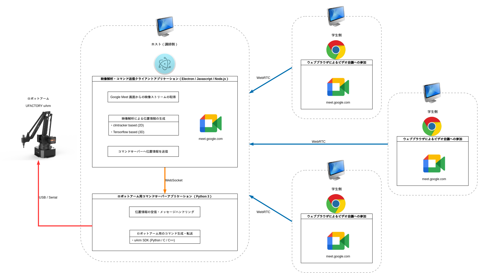

# FeelTool

## Alpha version system diagram

### client

A standalone web application to detect face motion, for test.

### client-with-uArm

A Python application, uArm control command sever.

### server

A Node.js (In the future release, it may become Electron app) application, handling video streams,  detecting face motion (Those sources are included in "public" subdirectory), sending message to uArm control command server.